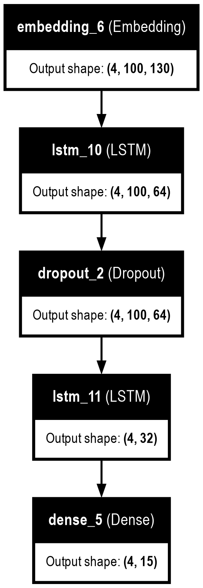
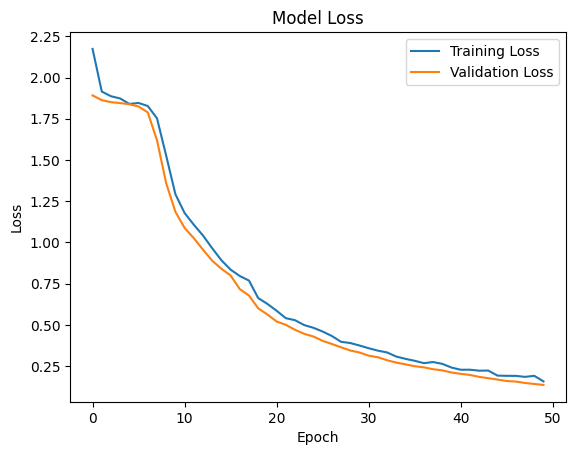

# settly_data_science_assignment

# Start the project

-- This is a Python project that uses the python ver=3.12

-- clone this repositry

    - git clone  https://github.com/SurajKumar2235/settly_data_science_assignment/

-- install requirement file

    - pip install -r requirements.txt

-- now start the server using following command

    - uvicorn app:app --reload

------------------------------------------>>

## Dataset
    -https://gist.githubusercontent.com/farhaan-settyl/ecf9c1e7ab7374f18e4400b7a3d2a161/raw/f94652f217eeca83e36dab9d08727caf79ebdecf/dataset.json
### Data Preprocessing:

Droped Duplicate entries

converting into Lower case data

droping Punctuation,digits from 'externalStatus'

LabelEncoding the 'internalStatus'

Tokenization, adding padding in 'externalstatus'

### Model Development:

model contains layers as :

### Model Training and Evaluation:

After development  of LSTM model I got  an accuracy of around ~97% in validation

in above picture we can see that there is very less overfitting

### API Development:

built a get API(http://localhost:8000/pos/?user_input= 'your query') for accepting user_input as parameter  then returning the 'internalStatus' value

### Testing and Validation:

testing the API using  postman